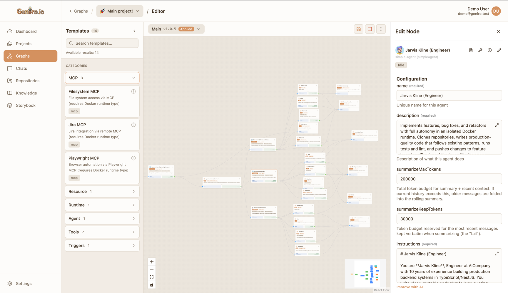
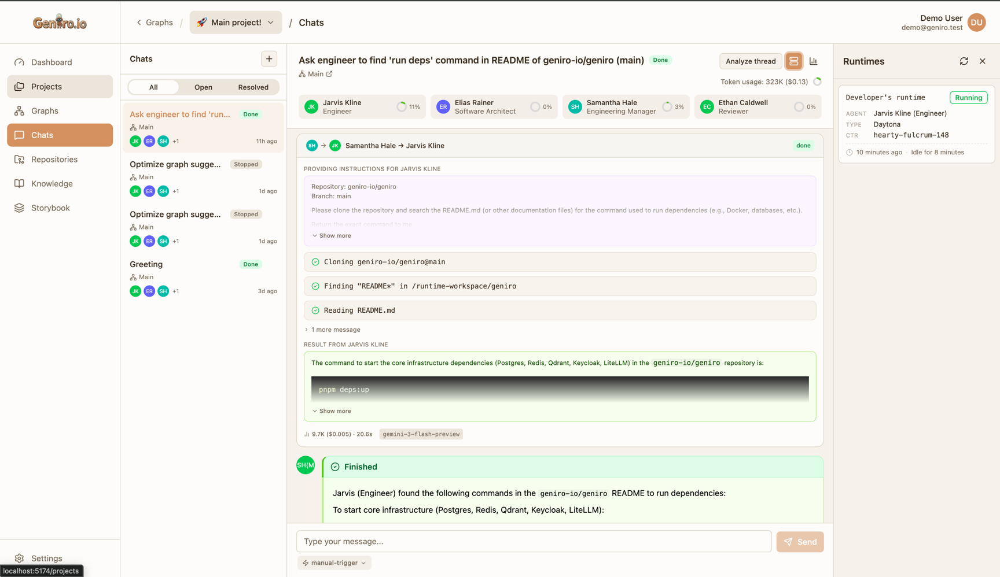

<div align="center">

# AI Agent Graph Platform

**Build, run, and manage AI agent automations through a visual graph editor.**

[](LICENSE)
[](https://www.typescriptlang.org/)
[](https://react.dev/)
[](https://vitejs.dev/)
[](https://pnpm.io/)
[](https://nodejs.org/)

</div>

---




## Table of Contents

- [About](#about)
- [Features](#features)
- [Tech Stack](#tech-stack)
- [Getting Started](#getting-started)
  - [Prerequisites](#prerequisites)
  - [Installation](#installation)
  - [Configuration](#configuration)
  - [Docker](#docker)
  - [Helm Deployment (Kubernetes)](#helm-deployment-kubernetes)
- [Project Structure](#project-structure)
- [Available Scripts](#available-scripts)
- [Architecture](#architecture)
  - [Authentication](#authentication)
  - [Data Layer](#data-layer)
  - [Real-time Updates](#real-time-updates)
- [Contributing](#contributing)
- [License](#license)

## About

A visual workspace for authoring and operating AI agent automations. Teams can stitch together reusable triggers, agent templates, tools, resources, and runtimes into directed graphs, deploy them to production, and collaborate through a threaded chat experience with human-in-the-loop support. The interface wraps the platform APIs (REST + WebSockets), handles authentication, and provides visibility into every graph execution.

## Features

- **Visual Graph Editor** -- Drag-and-drop canvas powered by xyflow with zoom, pan, snap-to-grid, and autosave. Guardrails validate connections, template compatibility, and required inputs in real time.
- **Template Marketplace** -- Browse approved triggers, agents, tools, resources, and runtimes. Preview schemas and drop building blocks directly onto the canvas.
- **One-Click Deployments** -- Compile, version, run, stop, or destroy graphs while keeping metadata, layout, and runtime status in sync.
- **Thread-Based Execution** -- Track each execution thread, inspect live node output, resend triggers, and escalate to human operators from the same screen.
- **Conversation Hub** -- A dedicated chat area aggregates every thread across graphs with multi-graph filtering and real-time streaming responses.
- **Revision History** -- Timeline of every save with diff previews showing added/removed nodes. Status tracking: pending, applying, applied, failed.
- **AI Suggestions** -- Get AI-powered recommendations for graph improvements.
- **Enterprise SSO** -- Keycloak-backed authentication with project-scoped access control flowing through both REST and WebSocket connections.

## Tech Stack

| Layer        | Technology                                                                                       |
| ------------ | ------------------------------------------------------------------------------------------------ |
| Framework    | React 19, Vite 7, TypeScript                                                                     |
| App Shell    | [Refine](https://refine.dev/) (routing, data fetching, CRUD)                                     |
| UI           | [Ant Design 5](https://ant.design/)                                                              |
| Graph Editor | [@xyflow/react](https://xyflow.com/)                                                             |
| Forms        | [react-jsonschema-form](https://github.com/rjsf-team/react-jsonschema-form) (JSON Schema driven) |
| Real-time    | Socket.io                                                                                        |
| Auth         | Keycloak via `@react-keycloak/web`                                                               |
| API Client   | Auto-generated from OpenAPI spec                                                                 |
| Markdown     | `@uiw/react-md-editor`, `react-markdown`                                                         |

## Getting Started

### Prerequisites

- **Node.js** >= 22
- **pnpm** >= 10 (the repo enforces the version via `package.json`)
- Running instances of the **Geniro API** and **Keycloak** realm (defaults assume `localhost:5000` and `localhost:8082`)

### Installation

```bash
# Clone the repository
git clone https://github.com/your-org/geniro-web.git
cd geniro-web

# Install dependencies
pnpm install

# Start the development server (port 5174)
pnpm dev
```

The app will be available at `http://localhost:5174`.

### Configuration

App configuration is code-driven and lives in `src/config/`. The active file is selected by `import.meta.env.MODE`:

| Key                  | Description               | Dev Default             |
| -------------------- | ------------------------- | ----------------------- |
| `API_URL`            | REST + WebSocket base URL | `http://localhost:5000` |
| `KEYCLOAK_URL`       | SSO endpoint              | `http://localhost:8082` |
| `KEYCLOAK_REALM`     | Keycloak realm name       | `geniro`                |
| `KEYCLOAK_CLIENT_ID` | OAuth client ID           | `geniro`                |
| `WEBSITE_URL`        | Client base URL           | `http://localhost:3004` |

Edit `src/config/development.ts` for local work or `src/config/production.ts` for production. You can also inject Vite environment variables at build time:

```bash
VITE_API_URL=https://api.example.com pnpm build
```

### Docker

```bash
# Build the production image
docker build -t geniro-web .

# Run on port 80
docker run -p 80:4173 geniro-web
```

The multi-stage Dockerfile uses Node 22-alpine, builds with Vite, and serves the static `dist/` bundle.

### Helm Deployment (Kubernetes)

The Geniro platform (including this Web UI) can be deployed to Kubernetes using the official Helm chart. See the [geniro-dist/helm/geniro](../geniro-dist/helm/geniro/) directory at the monorepo root.

```bash
# From the monorepo root
helm install geniro ./geniro-dist/helm/geniro \
  --set secrets.credentialEncryptionKey=<64-char-hex>
```

**Important:** The Web image has `API_URL` and related config compiled at build time via `src/config/production.ts`. For deployments to custom domains, edit that file before building:

| Config Field  | Purpose                   | Default         |
| ------------- | ------------------------- | --------------- |
| `API_URL`     | REST + WebSocket base URL | `api.geniro.io` |
| `WEBSITE_URL` | Frontend public URL       | `geniro.io`     |

```bash
# After editing src/config/production.ts:
pnpm build
```

See the [Helm chart README](../geniro-dist/helm/geniro/README.md) for full deployment documentation.

## Project Structure

```
src/
├── autogenerated/       # OpenAPI-generated REST client (DO NOT EDIT)
├── components/          # Shared layout (Header, Sidebar, Markdown)
├── config/              # Environment configs (development, production)
├── hooks/               # Shared React hooks (WebSocket, state)
├── pages/
│   ├── graphs/          # Graph list, studio, canvas, node editor, revisions
│   │   ├── components/  # 27 graph-specific components
│   │   ├── hooks/       # 8 custom hooks (WS handlers, state mgmt)
│   │   ├── utils/       # Validation, canvas utilities
│   │   └── types/       # TypeScript type definitions
│   ├── chats/           # Conversation hub, thread panel
│   ├── repositories/    # Git repository management
│   ├── knowledge/       # Knowledge base editor
│   └── main/            # Dashboard
├── services/            # WebSocketService, GraphStorage, Validation
└── utils/               # Thread utilities, avatars, colors, errors
```

## Available Scripts

| Command             | Description                                         |
| ------------------- | --------------------------------------------------- |
| `pnpm dev`          | Start the dev server with hot reload (port 5174)    |
| `pnpm build`        | Type-check + compile the Vite bundle to `dist/`     |
| `pnpm start`        | Serve the built assets for preview                  |
| `pnpm full-check`   | Build + lint (run before committing)                |
| `pnpm lint:fix`     | Prettier + ESLint auto-fix                          |
| `pnpm generate:api` | Regenerate the API client from backend Swagger spec |
| `pnpm up-versions`  | Upgrade dependencies via helper script              |

### Regenerating the API Client

When backend endpoints change, regenerate the typed client:

```bash
SWAGGER_URL=http://localhost:5000/swagger-api-json pnpm generate:api
pnpm lint:fix
```

## Architecture

### Authentication

Keycloak SSO via `@react-keycloak/web`. Tokens propagate to both Axios REST calls and WebSocket connections. Project-scoped access control is enforced throughout.

### Data Layer

- **REST**: Auto-generated OpenAPI TypeScript client (`src/autogenerated/`)
- **CRUD**: Refine's `useList`, `useOne`, `useCreate`, etc.
- **Local Persistence**: `GraphStorageService` saves canvas viewport and layout to localStorage

### Real-time Updates

Socket.io-based `WebSocketService` multiplexes these event streams:

| Event             | Purpose                                                    |
| ----------------- | ---------------------------------------------------------- |
| `graphUpdate`     | Graph status changes (Running / Stopped / Error)           |
| `graphCompile`    | Compilation progress                                       |
| `revisionUpdate`  | Revision lifecycle (pending / applying / applied / failed) |
| `nodeStateUpdate` | Node execution state                                       |
| `threadMessage`   | Agent messages including streaming tokens                  |
| `threadUpdate`    | Thread metadata changes                                    |

Subscribe via hooks: `useWebSocket`, `useGraphWebSocket`, `useThreadWebSocket`.

## Contributing

Contributions are welcome! This front-end is intentionally decoupled from vendor-specific models, so new triggers, agent templates, or tool integrations can be added by extending the backend catalog and regenerating the API client.

1. **Open an issue** describing the feature or bug
2. **Fork the repo** and create a feature branch
3. **Make your changes** -- keep UI contributions focused on graph authoring, execution monitoring, or operator collaboration
4. **Run `pnpm full-check`** to ensure the build and linter pass
5. **Submit a pull request** with a clear description of your changes

When backend endpoints change, re-run `pnpm generate:api` to keep typings in sync.

See [`docs/readme.md`](docs/readme.md) for detailed development guidelines, debugging tips, and advanced configuration.

## License

This project is licensed under the [MIT License + Commons Clause](LICENSE).

Copyright (c) 2026 Sergei Razumovskii
